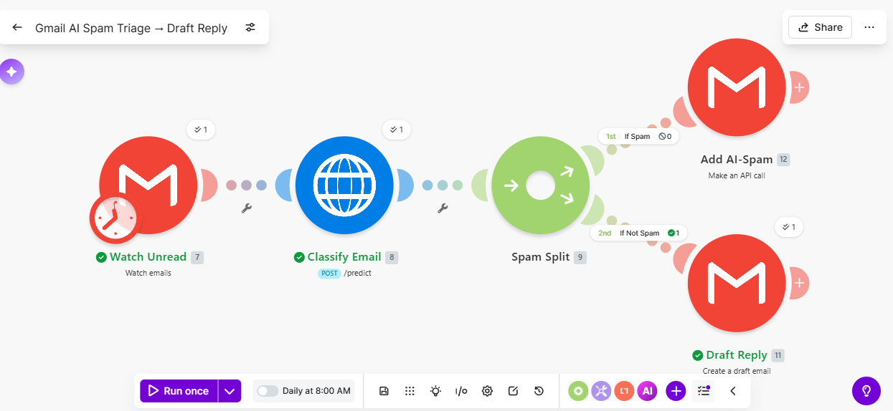
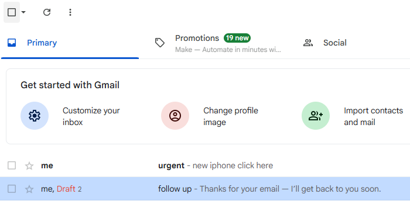
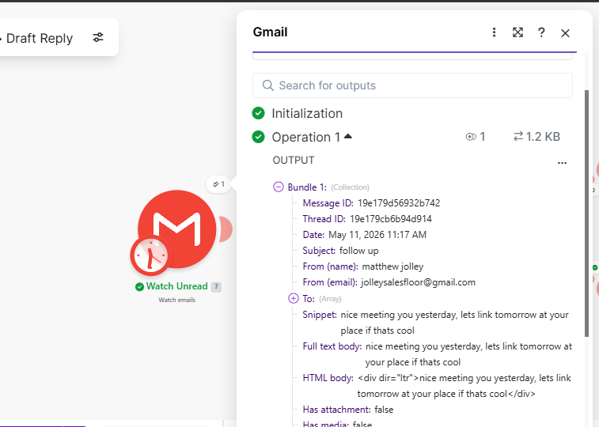
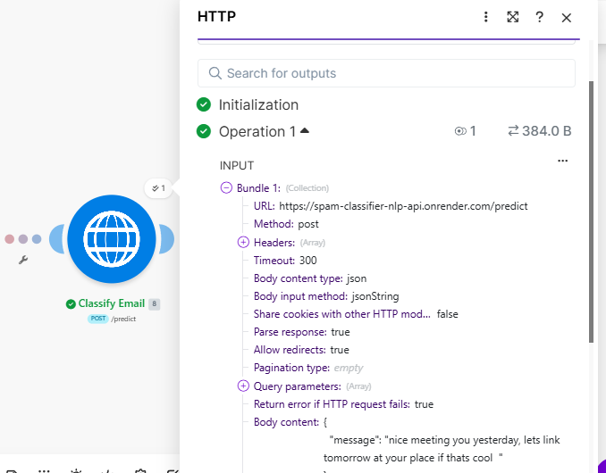
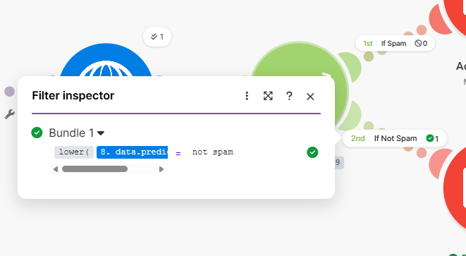
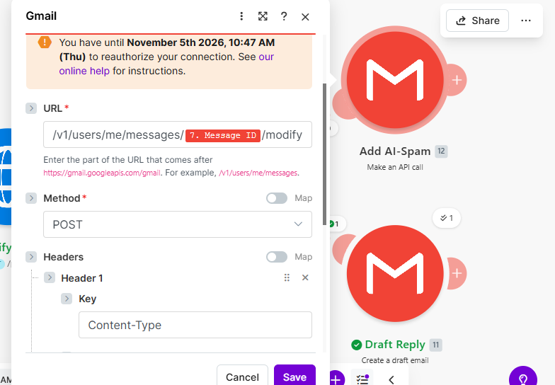
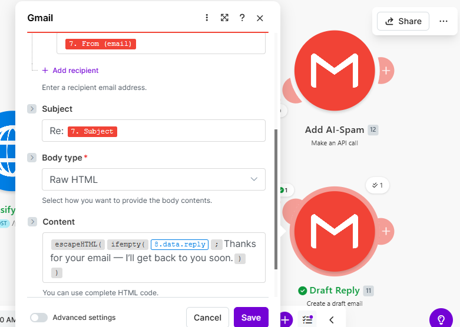

# Spam Classifier NLP

## Overview
Spam Classifier NLP is a deployed machine learning application that predicts whether a message is spam or not spam.

This project demonstrates natural language processing, text classification, model deployment, and API-ready machine learning engineering.

## Live Demo
## Make.com Gmail Workflow Integration

This NLP classifier was integrated into a Make.com workflow to classify Gmail email content through the deployed Flask API.

### Live Workflow Architecture

```text
Gmail Email Input
→ Make.com HTTP Request
→ Deployed Flask NLP API on Render
→ JSON Prediction Response
→ Router Filter
→ Spam or Ham Route
```

### API Endpoint

```text
POST /predict
```

### Example Request

```json
{
  "message": "WIN free money now click here"
}
```

### Example Response

```json
{
  "prediction": "spam"
}
```

### What This Integration Demonstrates

* Deployed machine learning model exposed as a live API
* Flask backend with a prediction endpoint
* NLP text classification using TF-IDF and logistic regression
* Make.com workflow automation
* Gmail email input integration
* HTTP API request/response handling
* Router-based spam/ham business logic
* Real-world AI automation pipeline

**This shows the model is not only a standalone web app, but also a usable backend API that can power automated business workflows.**

https://spam-classifier-nlp.onrender.com/

## Tech Stack
- Python
- Flask
- Scikit-learn
- Pandas
- NumPy
- Render

## Skills Demonstrated
- NLP classification
- Flask deployment
- Machine learning inference
- API-ready architecture

## Resume Bullet
Built and deployed an NLP spam classification web application using Python and Flask to classify text messages in real time.

This application demonstrates how machine learning can automatically identify spam messages for:

- customer communication filtering
- email/message moderation
- automated support systems
- message quality control
- AI-powered filtering systems

---

## How It Works

1. User enters a text message.
2. The application preprocesses the text.
3. TF-IDF vectorization converts the message into numerical features.
4. The trained classification model predicts whether the message is spam or not spam.
5. The prediction result is displayed in the browser.

---

## Machine Learning Workflow

1. Loaded labeled spam/ham dataset
2. Cleaned and prepared text data
3. Converted text into numerical vectors using TF-IDF
4. Trained a machine learning classification model
5. Saved the trained model and vectorizer
6. Connected the model to a Flask web application
7. Deployed the application online

---

## Project Structure

```text
spam-classifier-nlp/
├── app.py
├── train_model.py
├── model.pkl
├── vectorizer.pkl
├── spam.csv
├── requirements.txt
├── templates/
└── README.md

---

# Workflow Screenshots

## 1. Gmail Unread Email


## 2. Full Make.com Workflow


## 3. Gmail Extraction Output


## 4. NLP API Call


## 5. Router Logic


## 6. Spam Label Action


## 7. Draft Reply Automation


